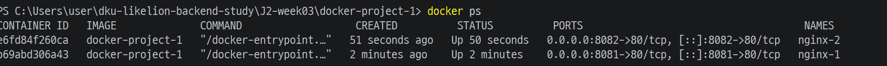
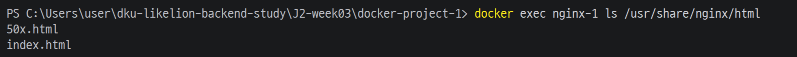
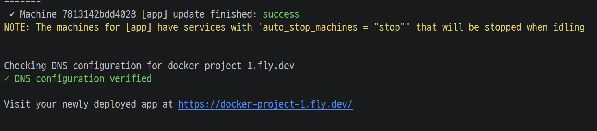
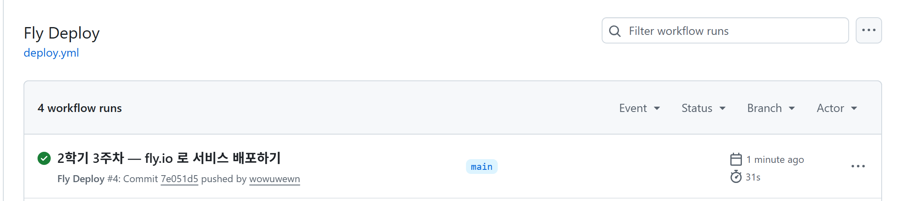
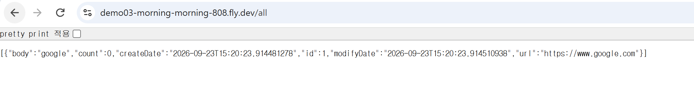

# 2학기 3주차 - fly.io 로 서비스 배포하기

`docker-project-1`에서 HTML 페이지를 Nginx 컨테이너로 실행하고 Fly.io에 올렸다.<br>
지난주 URL 단축 서비스도 `demo03`으로 가져와 배포하고, 외부 주소에서 URL 등록·조회·리다이렉트를 테스트했다.<br>
GitHub Actions를 연결해 `main` 브랜치에 앱 코드를 push하면 자동으로 다시 배포되도록 했다.

## 이번 주 한눈에 보기

| 구분 | 내용 |
| --- | --- |
| 배포 대상 | HTML 페이지, Spring Boot URL 단축 서비스 |
| 컨테이너 | Docker / Nginx |
| 배포 환경 | Fly.io |
| 환경 분리 | Spring Profile (`dev`, `prod`) |
| 자동 배포 | GitHub Actions |
| 비밀값 관리 | GitHub Secrets |
| 데이터 저장 | `ArrayList` 메모리 |

## 전체 흐름


`localhost`는 접속하는 기기 자신을 가리킨다. 내 PC에서 실행하던 서비스를 다른 곳에서도 접속할 수 있도록 외부 서버에 올리는 순서로 진행했다.

## Docker

Docker Desktop을 실행한 상태에서 [docker-project-1](./docker-project-1)의 이미지를 만들었다. [Dockerfile](./docker-project-1/Dockerfile)은 Nginx 이미지에 직접 작성한 HTML을 복사한다.

```dockerfile
FROM nginx
COPY index.html /usr/share/nginx/html/index.html
```

| 개념 | 의미 |
| --- | --- |
| Dockerfile | 이미지를 어떻게 만들지 적은 파일 |
| Image | 실행에 필요한 내용을 묶어둔 결과물 |
| Container | 이미지를 실제 실행한 상태 |

`docker build -t docker-project-1 .`으로 이미지를 만들고, 삭제한 뒤 다시 빌드해봤다. 같은 이미지로 `nginx-1`, `nginx-2` 컨테이너를 실행할 때는 PC 쪽 포트를 다르게 지정했다.

```sh
docker run -d --name nginx-1 -p 8081:80 docker-project-1
docker run -d --name nginx-2 -p 8082:80 docker-project-1
```

> `8081:80` — 내 PC의 `8081` 포트 → 컨테이너 내부 Nginx의 `80` 포트

두 컨테이너의 Nginx는 각각 내부 80번 포트에서 실행되고, PC에서는 8081과 8082로 구분해서 접근한다.

`docker ps`에서 두 컨테이너의 실행 상태와 포트 연결을 확인했다.



`docker exec nginx-1 ls /usr/share/nginx/html`로 컨테이너 안에 `index.html`이 있는지도 확인했다. 실습이 끝난 컨테이너는 `docker stop`으로 중지하고 `docker rm`으로 삭제했다.



## Fly.io 배포

### HTML / Nginx

로컬 Docker 컨테이너에서 돌던 HTML 페이지를 외부 서버에 올렸다. Fly.io의 명령줄 도구인 `flyctl`을 사용했고, `docker-project-1` 폴더에서 `fly launch --no-deploy`로 배포 설정을 만든 다음 `fly deploy`를 실행했다.

Nginx가 컨테이너 내부 80번 포트에서 실행되므로 [fly.toml](./docker-project-1/fly.toml)의 `internal_port`도 80으로 맞췄다. 배포 로그에서 `DNS configuration verified`를 확인했고, `docker-project-1.fly.dev` 주소로 HTML 페이지가 열렸다.



### Spring Boot

[demo03](./demo03)은 Java 21, Spring Boot 4.1.1을 사용한다. [Dockerfile](./demo03/Dockerfile)은 빌드 단계에서 Gradle로 JAR를 만들고, 실행 단계로 JAR를 복사하는 multi-stage build로 작성했다. JAR는 Java 애플리케이션을 묶은 파일이고, 실행할 때는 JVM이 필요하다.

Fly 앱 이름은 `demo03-morning-morning-808`이다. 운영 환경의 Spring Boot는 `server.port: 8090`으로 실행하고, [fly.toml](./demo03/fly.toml)의 `internal_port`도 8090으로 설정했다.

| 대상 | 애플리케이션 포트 | Fly.io `internal_port` |
| --- | ---: | ---: |
| Nginx | 80 | 80 |
| Spring Boot | 8090 | 8090 |

> 애플리케이션이 듣는 포트와 Fly.io가 요청을 전달하는 `internal_port`가 같아야 한다.

## 개발 / 운영 환경 분리

같은 코드라도 로컬 개발 환경과 실제 배포 환경에서 포트나 설정값을 다르게 쓸 수 있도록 Spring Profile로 설정을 나눴다.

| 설정 파일 | 적용 내용 |
| --- | --- |
| [application.yml](./demo03/src/main/resources/application.yml) | 공통 설정, 기본 Profile `dev`, 포트 8070, `secret` Profile 포함 |
| [application-dev.yml](./demo03/src/main/resources/application-dev.yml) | 사이트 이름 `My Site Dev` |
| [application-prod.yml](./demo03/src/main/resources/application-prod.yml) | 사이트 이름 `My Site Prod`, 포트 8090 |

Docker에서는 아래 실행 설정으로 `prod` Profile을 활성화했다.

```dockerfile
ENTRYPOINT ["java", "-Dspring.profiles.active=prod", "-jar", "app.jar"]
```

배포 주소의 `/`에서 `Hello, World!, on My Site Prod`가 나오는 것을 확인했다.

## GitHub Actions 자동 배포

코드는 GitHub에 저장하고, GitHub Actions가 배포 작업을 실행하도록 했다. Fly.io는 배포된 애플리케이션을 실행한다. push 이후에는 수동으로 `fly deploy`를 입력하지 않아도 자동으로 배포된다.

[deploy.yml](../.github/workflows/deploy.yml)에서 `main` 브랜치의 push를 처리한다. 앱이 저장소 루트가 아니라 `J2-week03/demo03`에 있어서 강의 예제의 경로를 수정했다.

| 항목 | 저장소에 맞춘 경로 |
| --- | --- |
| 변경 감지 | `J2-week03/demo03/**`, `.github/workflows/deploy.yml` |
| Secret 설정 파일 생성 | `J2-week03/demo03/src/main/resources/application-secret.yml` |
| 배포 실행 위치 | `J2-week03/demo03` |

```text
코드 수정 → git push → GitHub Actions 실행
  → application-secret.yml 생성
  → flyctl deploy --remote-only
  → Fly.io 재배포
```

README나 이미지만 바꾸는 push는 현재 변경 감지 경로에 포함되지 않는다.

컴파일 오류를 수정한 뒤 최종 Fly Deploy 실행에 성공 체크가 표시됐다.



## Secrets

> 비밀값을 코드 저장소에 올리지 않고 GitHub Secrets에서 관리했다.

- `FLY_API_TOKEN`: Actions에서 Fly.io에 배포할 때 사용하는 인증 토큰
- `APPLICATION_SECRET_YML`: Actions에서 `application-secret.yml`을 만들 때 사용하는 설정 내용

`application-secret.yml`은 [.gitignore](./demo03/.gitignore)로 Git에서 제외했다. 로컬에서는 별도 파일로 두고, 자동 배포 작업에서는 Actions 실행 시 GitHub Secret을 읽어 파일을 생성한다.

실습에서는 값이 주입되는지 확인하려고 `/secretKey`를 만들었다. 실제 서비스에서는 secret을 응답으로 노출하면 안 된다.

## URL 단축 서비스 확인

배포 주소: https://demo03-morning-morning-808.fly.dev

| 순서 | 기능 | 경로 | 확인 내용 |
| --- | --- | --- | --- |
| 1 | URL 등록 | `/add` | `body`와 `url`을 전달해 URL 등록 |
| 2 | 목록 확인 | `/all` | 등록된 URL 데이터의 JSON 응답 확인 |
| 3 | URL 이동 | `/g/1` | 등록한 실제 URL로 리다이렉트 확인 |

아래는 배포 서버의 `/all` 응답이다. `id: 1`, `body: "google"`, `url: "https://www.google.com"`으로 등록된 데이터가 보인다.



## 문제 해결

### Actions에서 secretKey 컴파일 오류

| 항목 | 내용 |
| --- | --- |
| 증상 | Actions의 Java 컴파일 중 `cannot find symbol`, `symbol: variable secretKey` 발생 |
| 확인 | 실패한 배포 step의 로그에서 컴파일 오류 확인 |
| 원인 | `HomeController`에서 필드 선언 없이 `return "secretKey : " + secretKey;` 사용 |
| 수정 | `@Value("${custom.secret.key}")`와 `private String secretKey;` 추가 |
| 결과 | 다시 push한 뒤 GitHub Actions 자동 배포 통과 |

> Actions 실패 → 배포 step 로그 확인 → Java 컴파일 오류 확인 → 필드 추가 → 다시 push → 자동 배포 성공

### 재시작 후 /g/1에서 500 오류

| 항목 | 내용 |
| --- | --- |
| 증상 | 배포 후 `/g/1` 요청에 `Whitelabel Error Page`, `500 Internal Server Error` 발생 |
| 원인 | 재시작으로 `ArrayList`가 초기화되어 이전에 등록한 `id=1`이 사라짐 |
| 오류 처리 | URL을 찾지 못하면 코드에서 `RuntimeException`을 던져 500으로 응답 |
| 다시 테스트 | `/add` → `/all` → `/g/1` 순서로 등록·확인하니 정상 이동 |
| 현재 한계 | URL 데이터가 JVM 메모리에만 존재 |
| 다음 단계 | DB 같은 영속 저장소 연결, 없는 id 요청의 응답 처리 |

현재 URL 데이터는 DB가 아니라 `SurlController`의 리스트에 저장한다.

```java
private List<Surl> surls = new ArrayList<>();
```

Fly.io 머신이나 애플리케이션 프로세스가 다시 시작되면 이 리스트도 새로 만들어진다.

```text
ArrayList → JVM 메모리에 저장
  → 재배포 / 프로세스 재시작
  → 메모리 초기화 → 데이터 유실
  → 계속 보관하려면 DB 같은 영속 저장소 필요
```

> 데이터를 다시 넣어 동작을 확인한 것이고, 저장 방식이나 없는 id에 대한 예외 처리를 고친 것은 아니다.

재시작 후에는 `/all`로 목록을 확인하고 다시 등록해야 한다. URL 데이터를 계속 유지하려면 DB 같은 영속 저장소가 필요하다. 없는 id를 요청했을 때의 응답 처리도 남아 있다.

## 이번 주 핵심

- Dockerfile → Image → Container 관계
- `8081:80`: PC 포트 → 컨테이너 내부 포트
- Spring Boot `server.port`와 Fly.io `internal_port` 일치
- `dev` / `prod` Profile로 환경별 설정 분리
- `git push` → GitHub Actions → Fly.io 자동 배포
- 비밀값은 GitHub Secrets로 관리하고 Git에서는 제외
- `ArrayList` 데이터는 프로세스가 재시작되면 사라짐
- 데이터를 유지하려면 DB 필요, 없는 id 요청의 응답 처리도 보완할 부분
