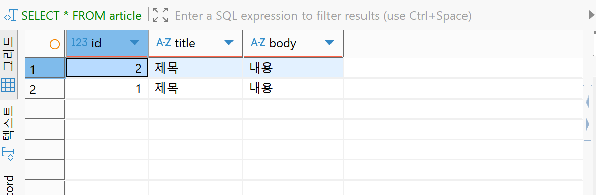
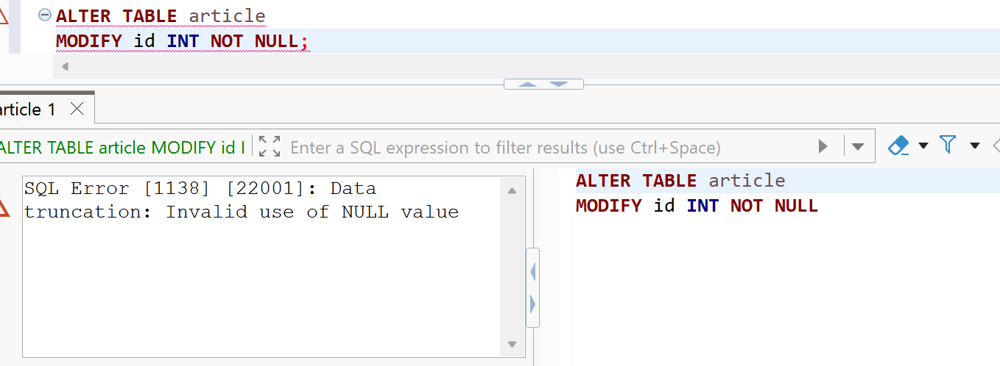
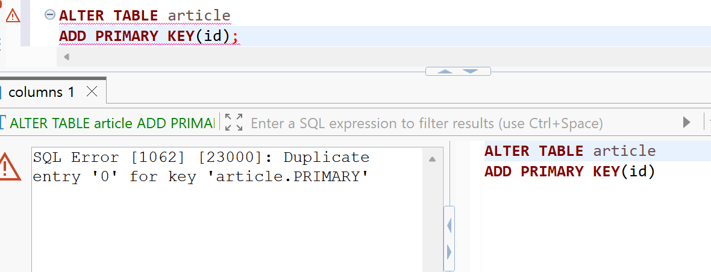
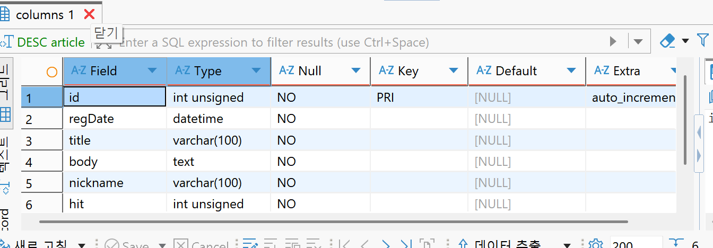
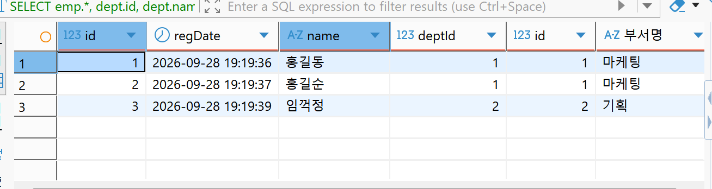
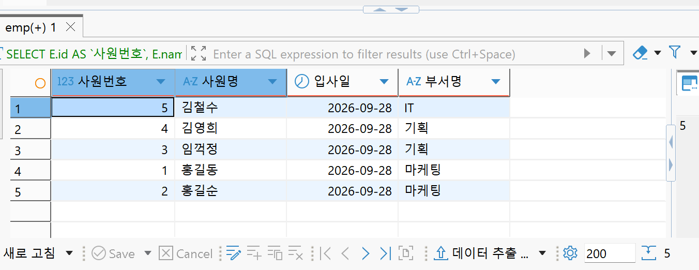

# 2학기 4주차 — 데이터베이스

지난주 Fly.io에 배포한 URL 단축 서비스는 재시작하면 `ArrayList`에 저장한 데이터가 사라졌다.<br>
데이터를 계속 보관하려면 애플리케이션 메모리 밖에 저장할 곳이 필요해서, 이번 주에는 MySQL과 SQL을 실습했다.<br>
DBeaver에서 게시물을 추가·조회·수정·삭제하고, 제약조건을 적용한 뒤 부서와 사원 테이블을 JOIN으로 조회했다.

학습 순서는 [강의 페이지의 데이터베이스 챕터 05](https://www.slog.gg/p/13485#f)를 따랐다. 이번에는 SQL을 직접 실행하는 단계까지 진행했고, Spring Boot와 MySQL은 아직 연결하지 않았다.

## 이번 주 한눈에 보기

| 구분 | 내용 |
| --- | --- |
| 학습 목표 | SQL로 데이터를 관리하고, 테이블 구조를 바꾸는 이유 이해하기 |
| 실습 도구 | MySQL / DBeaver |
| `a1` | 게시물 CRUD, id와 작성일 추가 |
| `a2` | 제약조건, 칼럼 변경, 조건 조회 |
| `a5` | 부서명 중복 저장 문제, 부서 번호로 변경, INNER JOIN |

## 이전 주차와의 연결

```text
1주차: Java List / ArrayList로 콘솔 Todo CRUD
  → 2주차: Spring Boot Controller에서 HTTP 요청 처리, URL 단축 서비스
  → 3주차: Docker / Fly.io 배포, 재시작하면 ArrayList 데이터 유실
  → 4주차: 데이터를 지속적으로 관리하기 위한 Database / MySQL / SQL 기초
```

입력 방식이 콘솔에서 HTTP 요청으로 바뀌어도 데이터를 추가·조회·수정·삭제한다는 흐름은 같았다. 이번에는 그 작업을 Java 리스트 대신 DB 테이블에서 SQL로 해봤다. 배포만으로 데이터가 유지되지는 않았기 때문에 저장 방식도 따로 배워야 했다.

## 실습 파일

| 파일 | 내용 |
| --- | --- |
| [article-crud.sql](./article-crud.sql) | DB 확인 → article 생성 → id와 regDate를 추가하면서 CRUD |
| [constraints.sql](./constraints.sql) | NULL·중복 id 정리 → 제약조건 → 칼럼 변경 → 조건 조회 |
| [inner-join.sql](./inner-join.sql) | deptName → deptId 전환 → JOIN 조건과 별칭 → 사원 추가 |
| [week04-article-constraints-practice.sql](./week04-article-constraints-practice.sql) | DBeaver에서 작성한 a1 / a2 실습 원본 |
| [week04-inner-join-practice.sql](./week04-inner-join-practice.sql) | DBeaver에서 작성한 a5 실습 원본 |

정리한 SQL은 위 순서로 각 파일의 처음부터 실행한다. 파일마다 해당 실습 DB를 삭제하고 다시 만들므로 `a1`, `a2`, `a5`에 보관할 데이터가 없는 실습 환경에서 사용한다. `mysql.user` 구조 조회에는 읽기 권한이 필요하다. 실패 SQL은 주석으로 남겼고, 다시 확인할 때는 해당 단계에서 한 문장씩 실행하면 된다.

## Database / MySQL / DBeaver

| 개념 | 이번 실습에서의 역할 |
| --- | --- |
| Database | 데이터를 테이블로 묶어 관리하는 공간. `a1`, `a2`, `a5`를 만들어 실습 구분 |
| DBMS | DB를 생성하고 데이터를 저장·조회·관리하는 프로그램 |
| MySQL | 이번 실습에서 사용한 DBMS |
| DBeaver | MySQL 서버에 접속해 SQL을 보내고 결과를 보는 도구 |
| Table | 같은 종류의 데이터를 담는 표. `article`, `dept`, `emp` |
| Row | 게시물 한 개, 사원 한 명에 해당하는 행 |
| Column | `id`, `title`, `body`처럼 각 행이 가지는 항목 |

DBeaver 자체가 DB는 아니다. DBeaver에서 SQL을 실행하면 연결된 MySQL이 처리하고, 그 결과를 DBeaver에서 확인한다. `SHOW DATABASES`로 DB 목록, `SHOW TABLES`로 선택한 DB의 테이블 목록, `DESC article`로 칼럼 구조를 확인했다.

## article CRUD

[article-crud.sql](./article-crud.sql)은 제목과 내용만 있는 테이블로 시작했다. `VARCHAR(100)`은 최대 100자의 문자열, `TEXT`는 긴 본문을 담는 데 사용했다.

```sql
CREATE TABLE article (
    title VARCHAR(100),
    `body` TEXT
);
```

| CRUD | SQL | 실습 내용 |
| --- | --- | --- |
| Create | `INSERT INTO` | 제목과 내용 저장, 이후 id가 3인 게시물 추가 |
| Read | `SELECT` | 제목만, 제목과 내용, 전체 칼럼 조회 |
| Update | `UPDATE ... SET` | 기존 행의 id와 작성일 채우기 |
| Delete | `DELETE FROM` | `WHERE id = 2`인 게시물 삭제 |

### id가 필요한 이유

같은 제목과 내용을 두 번 넣으니 어느 행이 어떤 게시물인지 구분하기 어려웠다. 테이블을 지우고 다시 만드는 대신 `ALTER TABLE`로 id를 맨 앞에 추가했다.

```sql
ALTER TABLE article ADD COLUMN id INT FIRST;

UPDATE article
SET id = 1
WHERE id IS NULL;

UPDATE article
SET id = 2
LIMIT 1;
```

칼럼만 추가했을 때 기존 행의 id는 `NULL`이었다. `IS NULL`인 행을 1로 바꾸자 두 행이 모두 1이 됐고, `LIMIT 1`로 한 행만 2로 바꿨다. 아래 화면은 NULL 상태가 아니라 번호를 채운 뒤의 결과다.



`LIMIT 1`은 한 행만 바꾼다는 뜻이고, 정렬 조건이 없으면 어느 행인지는 보장하지 않는다. 이후에는 `WHERE id = 2`처럼 번호로 삭제할 대상을 지정했다. 아직 이 단계에는 번호 중복을 막거나 자동으로 번호를 붙이는 제약조건이 없다.

### 작성일 추가

`regDate DATETIME`을 id 뒤에 추가하고, 기존 행의 비어 있는 작성일을 채웠다.

```sql
ALTER TABLE article ADD COLUMN regDate DATETIME AFTER id;

UPDATE article
SET regDate = '2018-08-10 15:00:00'
WHERE id = 1;

UPDATE article
SET regDate = NOW()
WHERE id = 3;
```

`DATETIME`은 날짜와 시간을 저장하는 자료형이고, `NOW()`는 실행 시점의 날짜와 시간을 반환하는 함수다. 칼럼을 추가하는 것과 기존 데이터에 값을 넣는 것은 별도 작업이었다.

## 제약조건과 칼럼 변경

[constraints.sql](./constraints.sql)에서는 id를 생략한 게시물 두 개를 넣고 시작했다. 값을 넣지 않아도 저장되는 상태에서 하나씩 제한을 추가했다.

### NULL 때문에 NOT NULL 적용 실패

| 항목 | 내용 |
| --- | --- |
| 증상 | `MODIFY id INT NOT NULL` 실행 시 `Invalid use of NULL value` |
| 원인 | 기존 두 행의 id가 이미 NULL |
| 수정 | 기존 id를 0으로 채운 뒤 NOT NULL 적용 |
| 결과 | NULL은 막았지만 두 행의 번호가 같은 문제는 남음 |



`NULL`은 값이 없다는 상태다. 0이나 빈 문자열과 다르고, 확인할 때도 `= NULL` 대신 `IS NULL`을 사용한다. 제약조건을 추가하려면 새 데이터뿐 아니라 이미 들어 있는 데이터도 조건을 만족해야 했다.

### 중복 id 때문에 PRIMARY KEY 적용 실패

| 항목 | 내용 |
| --- | --- |
| 증상 | `ADD PRIMARY KEY(id)` 실행 시 `Duplicate entry '0'` |
| 원인 | 두 행의 id가 모두 0 |
| 수정 | 한 행은 1, 나머지 행은 2로 변경 |
| 결과 | PRIMARY KEY를 적용한 뒤 AUTO_INCREMENT 추가 |



> NULL 정리 → NOT NULL → 중복 번호 정리 → PRIMARY KEY → AUTO_INCREMENT

| 설정 | 필요한 이유 |
| --- | --- |
| `NOT NULL` | 값이 없는 상태를 막음. 빈 문자열까지 막는 것은 아님 |
| `PRIMARY KEY` | 각 행을 식별하는 값으로 사용. 중복과 NULL을 허용하지 않음 |
| `AUTO_INCREMENT` | 새 행을 넣을 때 id를 직접 계산하지 않아도 번호 부여 |
| `UNSIGNED` | id와 조회수에 음수를 저장하지 않도록 범위 지정 |

이후 `regDate`, `title`, `body`에도 NOT NULL을 적용했다. 작성자를 추가하면서 칼럼 이름과 위치도 바꿨다.

| SQL | 실제 변경 |
| --- | --- |
| `ADD COLUMN` | title 뒤에 writer 추가, nickname 뒤에 hit 추가 |
| `CHANGE` | writer 이름을 nickname으로 변경 |
| `MODIFY COLUMN` | 자료형·제약조건 변경, nickname을 body 뒤로 이동 |
| `DROP COLUMN` | hit 삭제 후 다시 추가 |

기존 행의 빈 nickname은 `무명`으로 채웠다. 최종 구조에서 id는 `int unsigned`, `PRI`, `auto_increment`이고 모든 칼럼의 `Null`이 `NO`인 것을 확인했다.



## 조회 조건

작성자와 조회수가 다른 게시물을 추가한 뒤 필요한 행만 조회했다. 새 게시물은 id를 생략해도 3~6으로 저장된다.

| 조건 | 실습 SQL의 의미 |
| --- | --- |
| `ORDER BY hit DESC LIMIT 3` | 조회수 내림차순으로 상위 3개 |
| `WHERE nickname LIKE '홍길%'` | 작성자명이 홍길로 시작하는 게시물 |
| `WHERE hit >= 10 AND hit <= 55` | 조회수가 10 이상이면서 55 이하 |
| `WHERE nickname != '무명' AND hit <= 50` | 무명이 아니면서 조회수 50 이하 |
| `WHERE nickname = '무명' OR hit >= 55` | 무명이거나 조회수 55 이상 |

`WHERE`는 행을 고르는 조건, `ORDER BY`는 정렬, `LIMIT`은 결과 개수 제한이다. `AND`는 두 조건을 모두, `OR`는 하나 이상을 만족해야 한다. 조회수 10인 게시물이 두 개 있으므로 `ORDER BY hit DESC`만으로는 같은 조회수 사이의 순서까지 정해지지 않는다.

## 부서와 사원 테이블 / INNER JOIN

### deptName을 직접 저장했을 때의 문제

[inner-join.sql](./inner-join.sql)에서는 부서 `dept`와 사원 `emp`를 만들었다. `dept.name`에는 UNIQUE를 붙여 같은 부서명을 중복 등록하지 않게 했다. 처음에는 emp에도 부서명을 직접 저장했다.

| 사원 | emp.deptName |
| --- | --- |
| 홍길동 | 홍보 |
| 홍길순 | 홍보 |
| 임꺽정 | 기획 |

홍보를 마케팅으로 바꾸려면 `dept.name`뿐 아니라 두 사원의 `emp.deptName`도 수정해야 했다. dept만 수정한 상태에서는 두 테이블의 부서명이 달랐다.

```sql
UPDATE dept SET `name` = '마케팅' WHERE `name` = '홍보';
UPDATE emp SET deptName = '마케팅' WHERE deptName = '홍보';
```

부서명이 바뀔 때마다 여러 행을 수정해야 해서, 두 테이블을 다시 홍보로 복원한 뒤 사원 쪽에는 부서 번호를 저장하도록 바꿨다.

```sql
ALTER TABLE emp ADD COLUMN deptId INT UNSIGNED NOT NULL;
UPDATE emp SET deptId = 1 WHERE deptName = '홍보';
UPDATE emp SET deptId = 2 WHERE deptName = '기획';
ALTER TABLE emp DROP COLUMN deptName;
```

먼저 기존 이름을 번호로 옮기고 나서 deptName을 삭제했다. 이후 `dept.name`만 마케팅으로 바꿔도 사원의 소속 번호 1은 그대로 유지된다.

> deptId를 추가했다고 DB가 자동으로 dept와 연결하는 것은 아니다. 이번 실습에서는 deptId에 dept.id 값을 저장해 관계를 표현했고, FOREIGN KEY 제약조건은 선언하지 않았다.

### ON 없이 JOIN했을 때의 문제

```sql
SELECT emp.*, dept.name AS `부서명`
FROM emp
INNER JOIN dept;
```

MySQL에서는 이 SQL이 실행되지만, 당시 사원 3명과 부서 2개의 모든 조합인 6행이 나온다. 홍길동에게 기획이 붙고 임꺽정에게 마케팅이 붙는 등 실제 소속과 다른 조합도 포함된다. 문법 오류가 없어도 원하는 결과인지는 따로 확인해야 했다.

```sql
SELECT emp.*, dept.id, dept.name AS `부서명`
FROM emp
INNER JOIN dept
ON emp.deptId = dept.id;
```

`ON`으로 사원의 부서 번호와 부서 테이블의 id가 같은 행만 연결했다. 아래 결과에서는 deptId와 dept.id가 일치하고, 사원 3명에게 올바른 부서명이 붙는다. INNER JOIN은 연결 조건을 만족하는 조합만 보여준다.



### 별칭과 최종 조회

칼럼에는 `AS`로 사원번호·사원명·입사일·부서명이라는 출력 이름을 붙였다. 테이블도 `emp AS E`, `dept AS D`로 줄여 썼다. `DATE()`로 작성 시각에서 날짜 부분만 보여주고 실습에서는 이를 입사일로 표시했다.

기획부서 번호 2를 확인해 김영희를 추가하고, IT부서를 만든 뒤 번호 3으로 김철수를 추가했다. 마지막에는 아래 SQL로 5명의 소속을 조회했다.

```sql
SELECT E.id AS `사원번호`,
       E.name AS `사원명`,
       DATE(E.regDate) AS `입사일`,
       D.name AS `부서명`
FROM emp AS E
INNER JOIN dept AS D
ON E.deptId = D.id
ORDER BY `부서명`, `사원명`;
```



## 연결과 SQL 작성 중 겪은 문제

### MySQL / DBeaver 연결

root 계정으로 MySQL에 접속하는 단계에서 인증 문제가 있었다. MySQL 서버에 접속하는 계정 인증과 DBeaver의 드라이버 설정을 구분해서 확인해야 했다.

| 항목 | 내용 |
| --- | --- |
| 증상 | 연결 과정에서 `Public Key Retrieval is not allowed` 발생 |
| 원인 | 인증 과정에 필요한 서버 공개키를 드라이버가 가져오도록 허용되지 않음 |
| 수정 | DBeaver 연결의 Driver properties에서 `allowPublicKeyRetrieval=true` 설정 |
| 결과 | 연결 후 SQL 실습 진행 |

이 옵션은 서버에서 RSA 공개키를 가져오도록 허용하는 설정이다. root 비밀번호를 바꾸는 옵션은 아니다. 이번 로컬 실습의 연결 설정으로 기록했다. 옵션의 의미는 [MySQL Connector/J 문서](https://dev.mysql.com/doc/connector-j/en/connector-j-connp-props-security.html)에서도 확인할 수 있다.

### DESC 'user' 오류

```sql
-- 오류: 작은따옴표는 문자열 값
-- DESC 'user';

-- 테이블명은 식별자이므로 백틱 사용
DESC `user`;
```

`'제목'`처럼 작은따옴표는 값에 사용하고, 백틱은 테이블명이나 칼럼명을 감쌀 때 사용한다. `DESC`에는 조회할 테이블 이름이 필요했기 때문에 따옴표를 바꿔 해결했다.

## 이번 주 핵심

- 기존 Java CRUD와 같은 작업을 SQL의 INSERT / SELECT / UPDATE / DELETE로 해봤다.
- 칼럼을 추가해도 기존 데이터가 원하는 값으로 자동 변환되지는 않았다.
- 제약조건을 추가하기 전에 기존 NULL과 중복 데이터를 먼저 정리해야 했다.
- 부서명을 여러 곳에 저장하면 변경할 곳도 늘어난다. 사원에는 부서 번호를 저장하고 이름은 dept에서 관리했다.
- JOIN은 ON에 어떤 연결 조건을 쓰는지가 중요했다. 실행 성공과 올바른 조회 결과는 별개였다.

## 다음에 보완할 점

- 다음 Spring / JPA 학습에서는 이번에 다룬 테이블과 id가 Entity / Repository에 어떻게 연결되는지 확인할 예정이다. URL 단축 서비스의 ArrayList 저장을 바꾸고 재시작 후에도 데이터가 남는지 확인하는 작업은 아직 남아 있다.
- deptId의 참조 대상이 실제로 존재하는지 DB가 검사하도록 하는 FOREIGN KEY 제약조건은 별도로 학습할 부분이다.
- 강의 마지막 과제인 프로그래머스 SQL 고득점 Kit은 이번 기록에서 완료로 처리하지 않았다. SELECT → SUM·MAX·MIN → IS NULL → GROUP BY → JOIN → String·Date 순서로 풀고 풀이를 남길 예정이다.
