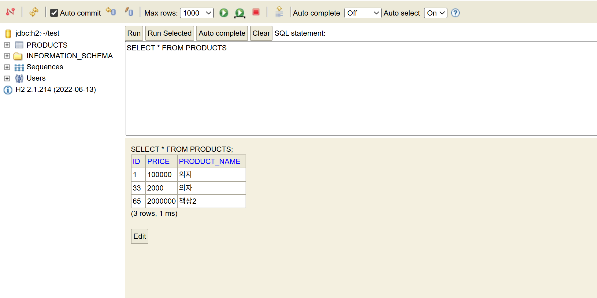

# 5주차 - Web 동작 원리 & Spring Boot

## 학습 내용
- Web 동작 원리 — 클라이언트와 서버의 만남
- Spring Boot 구조 및 작동 원리
- Spring Boot 데이터베이스 연동 및 CRUD API 구현

## 실습 코드
| 파일명 | 학습 내용 |
|--------|----------|
| `Product.java` | `@Entity`, `@Column` — DB 테이블 매핑, Getter & Setter |
| `ProductRepository.java` | `JpaRepository` 상속 — CRUD 메서드 자동 제공 |
| `ProductService.java` | CRUD 인터페이스 선언 |
| `ProductServiceImpl.java` | 실제 로직 구현, `Optional`로 null 안전 처리 |
| `ProductController.java` | `@RestController`, HTTP 메서드별 엔드포인트 매핑 |

## 새로 알게 된 것

### Web 동작 원리
- 브라우저에 `www.google.com` 입력 → DNS 서버가 해당 도메인의 IP 주소로 변환 → 그 IP의 서버에 요청 전송 → 응답 받아서 화면에 표시
- 서버는 요청마다 이전 요청을 기억하지 못함 → 로그인 후 다음 페이지로 넘어가도 서버 입장에선 처음 보는 요청 → 쿠키/세션으로 "이 사람 로그인했음"을 따로 저장해야 하는 이유
- `localhost:8080` — `localhost`는 내 컴퓨터 자신을 가리키는 주소(`127.0.0.1`), `8080`은 Spring Boot가 기본으로 열어두는 포트 번호

### Spring Boot 구조
- `@SpringBootApplication` 하나로 설정, 컴포넌트 스캔, 자동 설정 어노테이션 세 개를 한꺼번에 처리
- 톰캣 서버가 내장돼 있어서 `main()` 실행만으로 서버가 켜짐 → 기존 Spring은 톰캣 따로 설치하고 연동까지 직접 해야 했음
- 처음 `localhost:8080` 접속했을 때 Whitelabel Error Page가 뜨는 건 서버는 켜졌는데 연결된 URL이 없어서 → Controller 만들고 나서 사라짐

### MVC 흐름
- Controller → Service → Repository → DB 순서로 요청이 처리됨
- 카페로 비유하면: 손님(사용자) → 홀직원(Controller) → 주방(Service) → 식재료창고(Repository) → DB
- "책상 주문" 요청이 들어오면 Controller가 받아서 Service에 넘기고, Service가 실제 저장 처리를 Repository에 시킴
- 역할이 나뉘어 있어서 DB 저장 방식을 바꿔야 할 때 Controller나 Service는 건드리지 않고 Repository만 수정하면 됨
- `@Autowired` → 각 클래스 안에서 직접 `new`로 객체를 만들지 않아도 Spring이 알아서 연결해줌

### Postman으로 API 테스트
- Postman = 브라우저 대신 API 요청을 직접 보낼 수 있는 툴 (GET 외에 POST, PUT, DELETE도 테스트 가능)

```
① 생성 (POST)
POST http://localhost:8080/api/products
Body: { "productName": "책상", "price": 140000 }

② 조회 (GET)
GET http://localhost:8080/api/products/1

③ 수정 (PUT)
PUT http://localhost:8080/api/products/1
Body: { "productName": "책상 2", "price": 200000 }

④ 삭제 (DELETE)
DELETE http://localhost:8080/api/products/1
```

### H2 Console
- 앱 실행 중에만 데이터 유지, 끄면 초기화 → DB 따로 설치 없이 테스트할 때 빠르게 쓰는 용도
- `application.properties`에 `spring.h2.console.enabled=true` 추가하면 `localhost:8080/h2-console`에서 테이블 직접 조회 가능
- `Optional<Product>` — 조회 결과가 없을 때 null 대신 빈 값으로 안전하게 처리, `isPresent()`로 존재 여부 확인 후 사용



## 오류 해결

### Project JDK is not defined
IntelliJ 상단에 노란 경고가 뜨면서 빌드 자체가 안 됨.  
`File → Project Structure → Project → SDK`에서 zulu-11 선택 후 해결.

### Run 버튼 비활성화
▶️ 버튼이 회색으로 눌리지 않음. IntelliJ Community 버전은 Spring Boot 실행 구성을 자동으로 잡아주지 않음.  
JetBrains 학생 인증으로 Ultimate 무료 업그레이드 후 해결 (2027년까지 유효).

### ClassNotFoundException — Java 버전 충돌
```
오류: 기본 클래스 com.test.SpringBootApi.SpringBootApiApplication을(를)
찾거나 로드할 수 없습니다.
원인: java.lang.ClassNotFoundException
```
`build.gradle`은 Java 11 기준, IntelliJ는 Java 21 사용 중 → 서로 다른 버전으로 만들어진 파일이라 실행 불가.  
`build.gradle`의 `sourceCompatibility = '11'` → `'17'` 수정, SDK Java 21로 통일 후 Gradle 재동기화 → 정상 실행.

### gradlew bootRun 안 됨
`gradle-wrapper.jar`가 프로젝트에 없어서 발생. Spring Initializr 다운로드 시 누락된 것으로 추정.  
위 버전 충돌 해결 과정에서 함께 해결됨.
