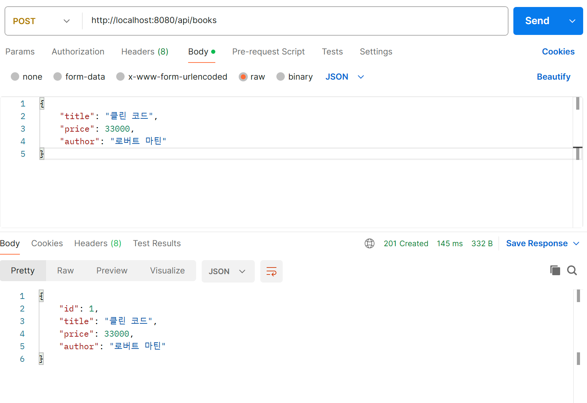
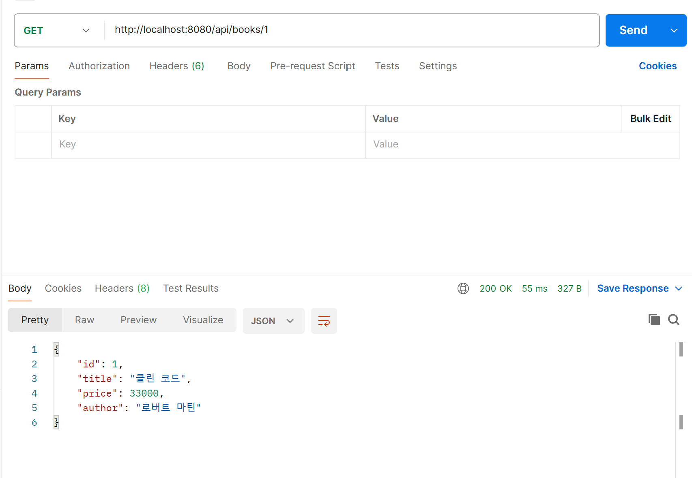
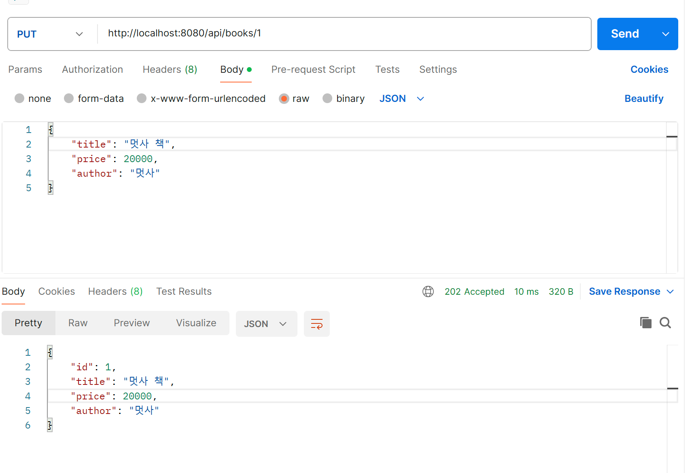
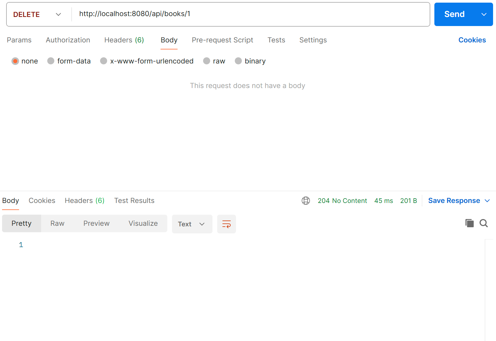
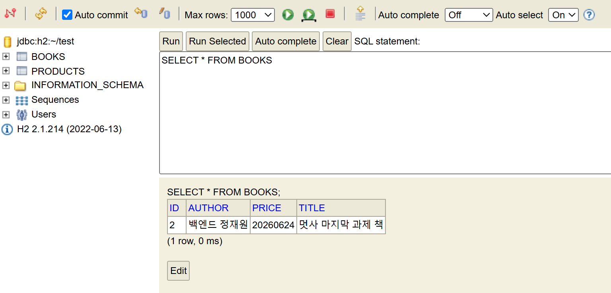

# 📚 Week 06 — 파이널 프로젝트: Books CRUD API

Spring Boot로 책 정보(제목·가격·저자)를 관리하는 CRUD API를 구현했다.
5주차에서 배운 Product CRUD 구조를 Books에 그대로 적용한 프로젝트.

## 🛠️ 기술 스택
- Java 17 / Spring Boot 2.7.8
- Spring Data JPA
- H2 Database (인메모리)
- Postman (API 테스트)

## 📂 프로젝트 구조
~~~
SpringBootApi/src/main/java/com/test/SpringBootApi/
├── domain/Book.java                 # @Entity 모델 (title, price, author)
├── respository/BookRepository.java  # JpaRepository 상속
├── service/BookService.java         # 인터페이스
├── service/BookServiceImpl.java     # 구현 (try-catch + Optional)
└── controller/BookController.java   # REST API
~~~

## 🔗 API 명세
| 기능 | Method | URL | 상태 코드 |
|------|--------|-----|-----------|
| 생성 | POST | `/api/books` | 201 Created |
| 조회 | GET | `/api/books/{id}` | 200 OK |
| 수정 | PUT | `/api/books/{id}` | 202 Accepted |
| 삭제 | DELETE | `/api/books/{id}` | 204 No Content |

## 🧪 API 테스트 결과

### 1. 생성 (POST)
`POST /api/books` — 책을 생성하면 `id`가 자동 부여되고 `201 Created` 반환.

### 2. 조회 (GET)
`GET /api/books/1` — `id`로 책을 조회하면 `200 OK`와 함께 데이터 반환.

### 3. 수정 (PUT)
`PUT /api/books/1` — 기존 데이터를 새 값으로 덮어쓰고 `202 Accepted` 반환.

### 4. 삭제 (DELETE)
`DELETE /api/books/1` — 책을 삭제하면 본문 없이 `204 No Content` 반환.

### 5. H2 콘솔 확인
`localhost:8080/h2-console`에서 `SELECT * FROM BOOKS`로 저장된 데이터 확인.

## 💡 배운 점
- `JpaRepository`만 상속하면 기본 CRUD 메서드가 자동 생성된다.
- Service를 인터페이스 + 구현(Impl)으로 나누면 역할이 명확해진다.
- `update`는 기존 데이터를 조회 → setter로 덮어쓰기 → 재저장하는 흐름.
- `Optional.isPresent()`로 데이터 존재 여부를 안전하게 체크한다.
- HTTP 상태 코드(201/200/202/204)로 요청 처리 결과를 구분한다.

## 🐛 막혔던 부분 & 해결
- 프로젝트 실행 중에는 파일이 잠겨서 폴더 복사가 안 됨 → 서버(빨간 ■) 종료 후 복사.
- DELETE 후 테이블이 비어 H2 조회 시 데이터 없음 → POST로 다시 넣고 확인.
